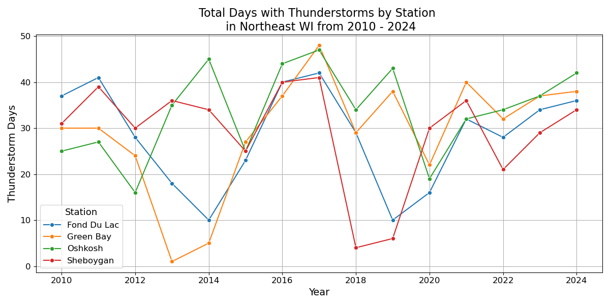
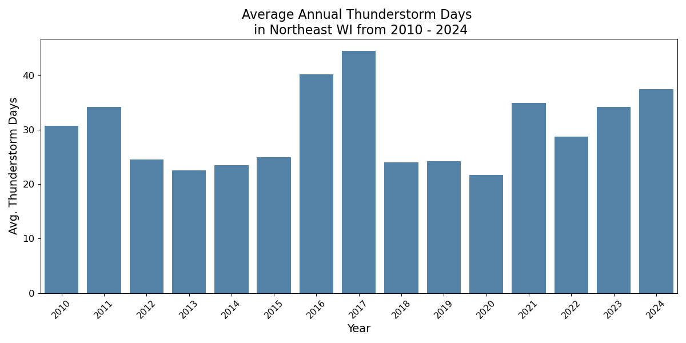
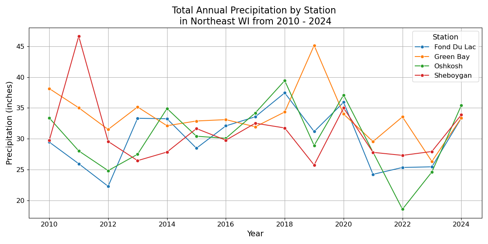
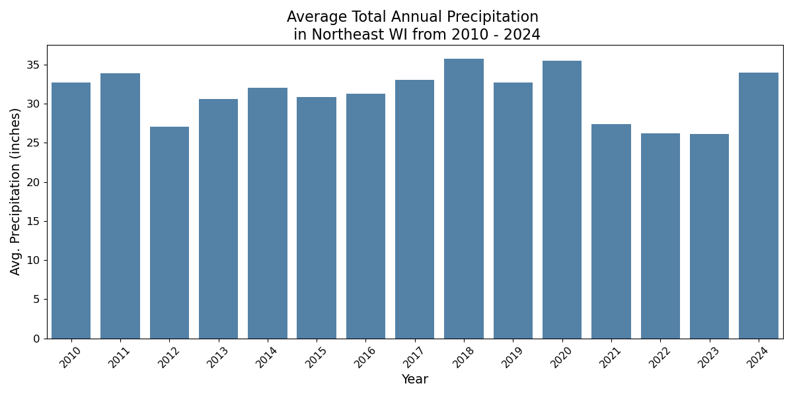

# Trends in Thunderstorm Days and Precipitation in Northeast Wisconsin from 2010 - 2024

### Introduction and Motivation 

With constant talk of global warming and rising natural disasters, it's easy to feel like the world is falling apart. Living in Northeast Wisconsin for most of my life, I’m convinced that severe weather has become more common in our area. Not only do I believe we've seen an uptick in storms, but I also think we've received more rainfall than average in recent years. For instance, I clearly remember last year how difficult it was to get crops in the ground or make hay during the summer, it felt like it never stopped raining.

This report aims to explore whether these observations are backed up by the data. The central research question is: Has severe weather and precipitation increased in Northeast Wisconsin? My hypothesis is that it has. To investigate this, I analyze trends in the number of thunderstorm days and total precipitation over time, both at individual weather stations and as a regional average in Northeast Wisconsin.

### Data and Methods 

The data used in this study comes from the U.S. Local Climatological Data (LCD) provided by the National Oceanic and Atmospheric Administration (NOAA). This platform offers a wide variety of weather variables, including: temperature, humidity, sky conditions, and more. However, to evaluate severe weather trends, I focused on the most relevant reported variable: Days with Thunderstorms. I also included total annual precipitation to explore the second part of my research question.

The dataset includes observations from four weather stations across Northeast Wisconsin: Fond Du Lac, Green Bay, Oshkosh, and Sheboygan. This provides a view of both localized weather patterns and regional trends for Northeast Wisconsin as a whole.

Although the original plan was to analyze data from 2010 through the present data in 2025, I ultimately excluded 2025. Since this report was created in early June, the 2025 data was incomplete and not representative, especially given that summer is typically peak storm season. Therefore, this analysis covers the full years from 2010 through 2024.

Both precipitation and thunderstorm days were originally reported as monthly totals. I first converted these monthly values into annual totals for each station to capture year-to-year variability. Then, I calculated the average across all four stations to produce a broader regional measure. 

### Results 

The line plot in Figure 1 shows the total number of days with thunderstorms recorded annually at each of the four weather stations from 2010 to 2024. While there's some year-to-year fluctuation, a few clear patterns emerge. Notably, 2017 stands out as a peak year for thunderstorm activity across all stations, with each location reporting over 40 thunderstorm days. In contrast, 2015 and 2018 saw sharp declines in activity at some stations, particularly Sheboygan, which reported fewer than 10 thunderstorm days in 2018.

Overall, the trends suggest high variability rather than a consistent increase or decrease over time. However, thunderstorm activity has remained relatively elevated since 2021, with fewer of the extreme lows seen in earlier years. This supports the idea that recent years may have experienced more frequent severe weather events.

##### Figure 1: Total Thunderstorm Days by Station

Figure 2 builds on the data shown in Figure 1 by averaging thunderstorm days across all four stations to provide a broader regional view of thunderstorm activity in Northeast Wisconsin. The overall pattern in this figure mirrors the variability seen in the station-level line plot. While thunderstorm activity fluctuates throughout the period, 2016 and 2017 stand out as especially active years, each averaging more than 40 thunderstorm days.

Surrounding this peak, the years before and after show noticeably fewer thunderstorm days. However, starting in 2021, there appears to be a modest upward trend, with storm days increasing each year through 2024. This recent uptick could suggest a rise in severe weather activity, potentially supporting the initial hypothesis.

That said, these fluctuations still fall within the general range observed in earlier years. Given this context, the recent increase may reflect normal variability rather than a meaningful long-term trend. At this stage, there isn’t strong evidence of a clear and sustained rise in thunderstorm activity or severe weather that would indicate a cause for concern.

##### Figure 2: Average Annual Thunderstorm Days

Figure 3 displays total annual precipitation recorded at each of the four weather stations. While there is some variability year to year and between stations, the general trend does not show a clear upward or downward trajectory in precipitation levels across the region.

Some standout years include 2011 and 2019, where Sheboygan and Green Bay, respectively, recorded notably high precipitation totals at or above 45 inches. In contrast, 2022 appears to be a particularly dry year for Oshkosh, which dropped below 20 inches. The rest of the years tend to fluctuate between approximately 25 and 40 inches of annual precipitation depending on the location.

There is no strong evidence of a consistent increasing trend over the 15-year period. The variation seen here appears to reflect normal year-to-year climate fluctuations rather than a definitive shift in long-term precipitation patterns.

##### Figure 3: Total Annual Precipitation by Station 

Similarly to Figure 2, Figure 4 builds on the data shown in Figure 3 by averaging annual precipitation across all four stations to provide a broader regional view of thunderstorm activity in Northeast Wisconsin. In general, precipitation levels remain relatively steady throughout the period, generally ranging between 28 and 35 inches per year. The years 2018 and 2020 stand out as particularly wet, with both recording just over 35 inches of precipitation.

In contrast, 2021 through 2023 show a noticeable dip, with all three years falling below 30 inches. This decline runs counter to my initial hypothesis that precipitation has been steadily increasing over time. Interestingly, 2024 shows signs of recovery, with precipitation rebounding closer to earlier averages, aligning more closely with my observations from last year.

Overall, precipitation in Northeast Wisconsin has remained fairly consistent over time, with some recent variability but no clear long-term upward trend. In fact, the slight dip in recent years suggests a pattern opposite of what I expected to find.

##### Figure 4: Average Annual Precipitation

### Conclusions and Further Analysis 

Overall, the trends in both thunderstorm frequency and total precipitation from 2010 to 2024 appear to fall within the bounds of normal weather variability. While some years stood out as outliers, there is no clear upward or downward trend that would suggest a growing concern around severe weather patterns in Northeast Wisconsin over this 15-year period.

That said, the relatively short time frame of this analysis may limit the ability to detect long-term climatic shifts. Future research could benefit from incorporating a much longer historical dataset, extending back to the early 1900s, to better assess slow-moving climate trends. Additionally, incorporating other indicators of severe weather, such as maximum wind gust speeds or hail events, could provide a more comprehensive picture of how severe weather is evolving over time.

You can find the full analysis, source code, and figures from this project on GitHub here: 
https://github.com/hjdowney-25/Climate_Data_Project
